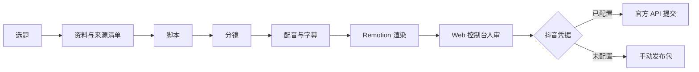

# AI Knowledge Video Agent

面向抖音知识科普账号的本地 AI 视频制作 MVP：从选题、资料来源、脚本、分镜、配音、字幕、Remotion 渲染，到人审后的抖音官方 API 发布或手动发布包导出。

第一条样片主题：**大模型为什么会幻觉？**

## 功能

- 2-3 分钟中文 AI 科普视频工作流
- 9:16 竖屏 Remotion 动态图文模板
- 来源清单、脚本、分镜、字幕、发布文案全流程留痕
- 本地 Web 控制台：创建选题、生成内容、渲染成片、查看来源、确认发布
- TTS 可插拔：`edge` 云端中文开发默认、`openai`、`mock`
- 发布可插拔：抖音官方 OpenAPI 优先，未配置凭据时导出手动发布包
- 单元测试覆盖 schema、时长、字幕、来源和密钥卫生

## 快速开始

```bash
pnpm install
Copy-Item .env.example .env
pnpm sample
pnpm --filter @aivideo/renderer render:latest
pnpm dev
```

打开控制台：

```text
http://127.0.0.1:5173
```

API 默认运行在：

```text
http://127.0.0.1:8787
```

生成结果会保存在：

```text
data/runs/<run_id>/
```

## 工作流



## 项目结构

```text
apps/
  api/        Fastify 本地 API
  console/    React/Vite 控制台
  renderer/   Remotion 视频模板与渲染脚本
packages/
  core/       schema、存储、流水线、服务商适配器、测试
docs/         使用、配置、抖音接入和开发说明
samples/      样片 brief
data/runs/    本地生成任务，默认不提交 Git
```

## 常用命令

```bash
pnpm dev                       # 同时启动 API 与控制台
pnpm sample                    # 创建并生成“幻觉”样片任务
pnpm --filter @aivideo/renderer render:latest
pnpm test
pnpm typecheck
pnpm build
```

## 配置

复制 `.env.example` 为 `.env` 后按需填写。

- `TTS_PROVIDER=edge`：开发默认，使用在线中文语音。
- `edge` 不可用时会自动降级为同等时长的测试音频，正式运营建议配置稳定云端 TTS。
- `TTS_PROVIDER=openai`：需要 `OPENAI_API_KEY`。
- `TTS_PROVIDER=mock`：测试用静音音频。
- `DOUYIN_ACCESS_TOKEN`、`DOUYIN_OPEN_ID`：配置后才能走抖音官方发布接口。

所有密钥只放 `.env` 或本机环境变量，禁止提交到仓库。

## 安全边界

- 不做浏览器自动化模拟发布。
- 不做后台全自动发布。
- 调用抖音发布接口前必须在 Web 控制台显式确认。
- 未配置抖音凭据时只生成 `mp4 + 封面 + 标题 + 简介 + 话题 + 来源清单`。

## 文档

- [使用手册](docs/user-manual.md)
- [配置说明](docs/configuration.md)
- [抖音发布接入](docs/douyin-publishing.md)
- [开发说明](docs/development.md)
- [样片说明](docs/sample-topic.md)

## 参考

- [Short Video Maker](https://github.com/gyoridavid/short-video-maker)
- [MoneyPrinterTurbo](https://github.com/harry0703/MoneyPrinterTurbo)
- [NarratoAI](https://github.com/linyqh/NarratoAI)
- [Remotion AI Video](https://www.remotion.dev/docs/ai-video)
- [抖音开放平台视频发布](https://developer.open-douyin.com/docs/resource/zh-CN/dop/develop/openapi/content-management/video-management/douyin/create-video)
- [NarrAgent / arXiv](https://arxiv.org/html/2509.16811v1)

## License

MIT
